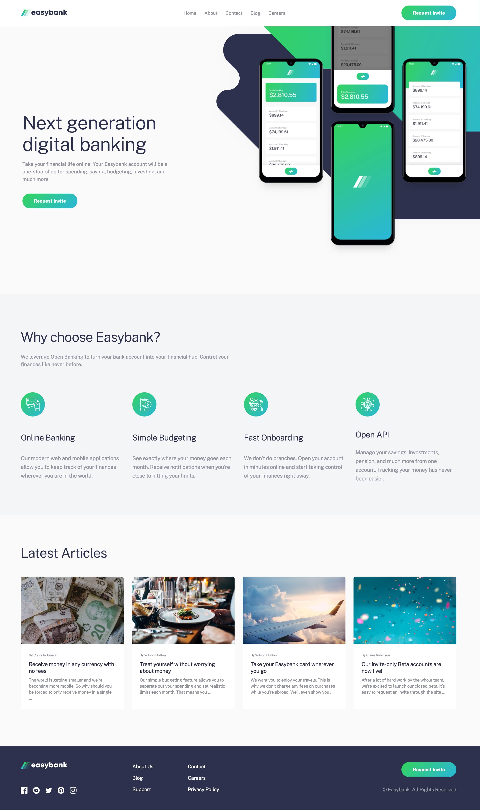

# Frontend Mentor - Easybank landing page solution

This is a solution to the [Easybank landing page challenge on Frontend Mentor](https://www.frontendmentor.io/challenges/easybank-landing-page-WaUhkoDN). Frontend Mentor challenges help you improve your coding skills by building realistic projects.

## Table of contents

- [Frontend Mentor - Easybank landing page solution](#frontend-mentor---easybank-landing-page-solution)
  - [Table of contents](#table-of-contents)
  - [Overview](#overview)
    - [The challenge](#the-challenge)
    - [Screenshot](#screenshot)
    - [Links](#links)
  - [My process](#my-process)
    - [Built with](#built-with)
    - [Continued development](#continued-development)
  - [Author](#author)

## Overview

### The challenge

Users should be able to:

- View the optimal layout for the site depending on their device's screen size
- See hover states for all interactive elements on the page

### Screenshot

### Links

- Solution: [Github](https://github.com/mkokaras/easybank-landing-page)
- Site: [Github Pages](https://mkokaras.github.io/easybank-landing-page/)

## My process

### Built with

- Semantic HTML5 markup
- SASS
- Flexbox
- CSS Grid
- Mobile-first workflow
- Responsive Navigation

### Continued development

- Bring the hero images closer to the design
- Enchance the responsiveness for other device dimensions.

## Author

- Github - [Menelaos Kokaras](https://github.com/mkokaras)
- Frontend Mentor - [@mkokaras](https://www.frontendmentor.io/profile/mkokaras)
- Linkedin - [@menelaos-kokaras](www.linkedin.com/in/menelaos-kokaras-9a6618235)
